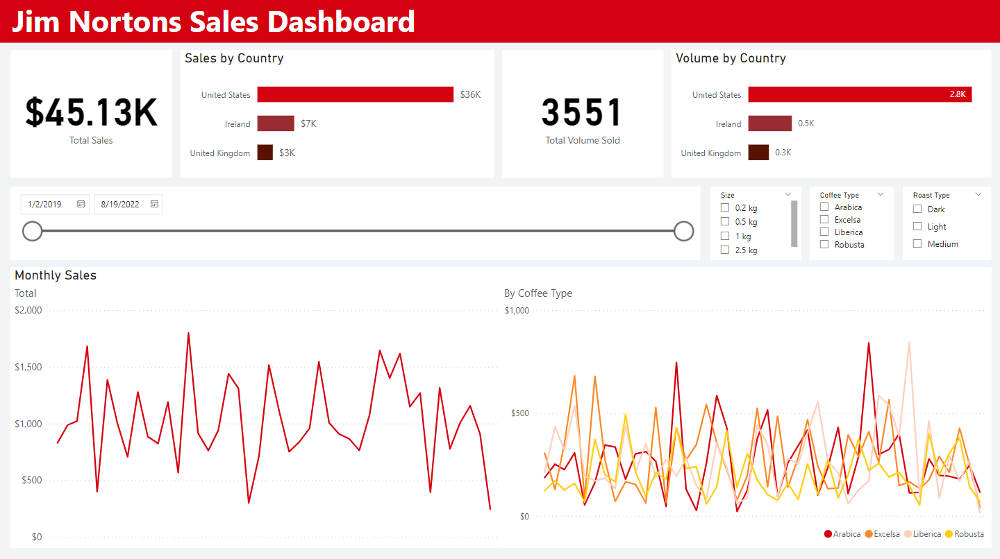
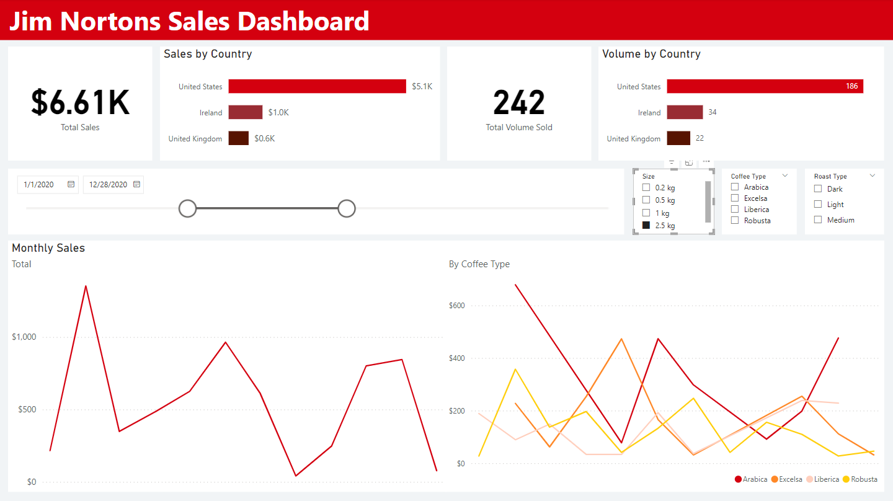
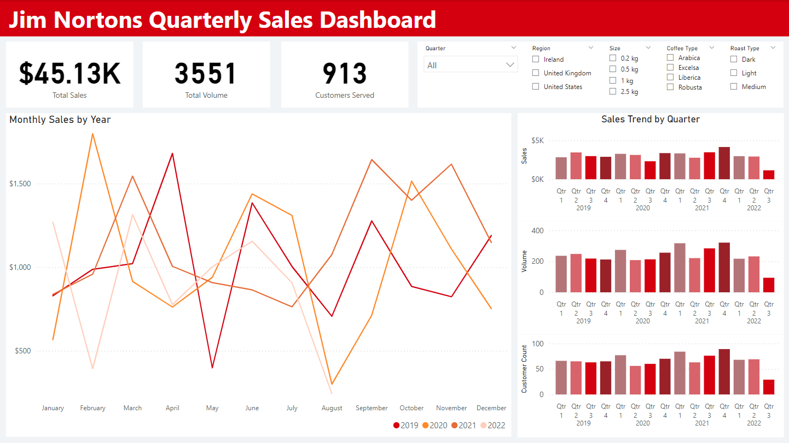
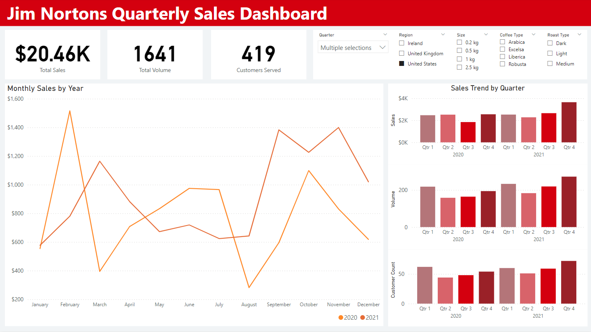

## Table of Contents
- [Background and Overview](#background-and-overview)
- [Dashboard Previews](#dashboard-previews)
- [Limitations](#limitations)

## Company Background 
Jim Nortons is a fast-growing American quick-service coffee chain. Founded in recent years and locations throughout the US, UK, and Ireland, the brand is focused on expanding its footprint and establishing a global presence in the future, offering quality coffee in a welcoming environment.
 
## Dashboard Previews
### General Sales Dashboard
This dashboard offers a comprehensive overview of sales across key regions (US, UK, and Ireland) with detailed KPIs such as total sales and volume sold. The line charts enable the identification of monthly trends, both overall and by coffee type, helping to understand demand patterns. The interactive slicers (date, size, coffee type, and roast type) allow stakeholders to drill down into specific segments, enabling more precise decision-making on inventory, marketing, and regional strategies.

### Quarterly Sales Dashboard
This dashboard focuses on quarterly performance with metrics like total sales, volume, and customers served. The line chart highlights monthly sales trends by year, while the bar charts break down quarterly sales, volume, and customer counts for a more granular view of performance. With slicers for quarter, region, size, coffee type, and roast type, this dashboard provides flexibility to analyze trends over time and across different business dimensions, aiding in targeted planning and goal setting.

## Limitations
The dataset utilized for the project is fictional and may not accurately reflect realistic sales trends or customer behavior. As such, the patterns and conclusions drawn from the dashboards should not be interpreted as representative of actual market conditions. The primary aim of this project was to demonstrate proficiency in data cleaning using advanced Excel functions such as XLOOKUP and INDEX MATCH and dashboard creation in Power BI.
